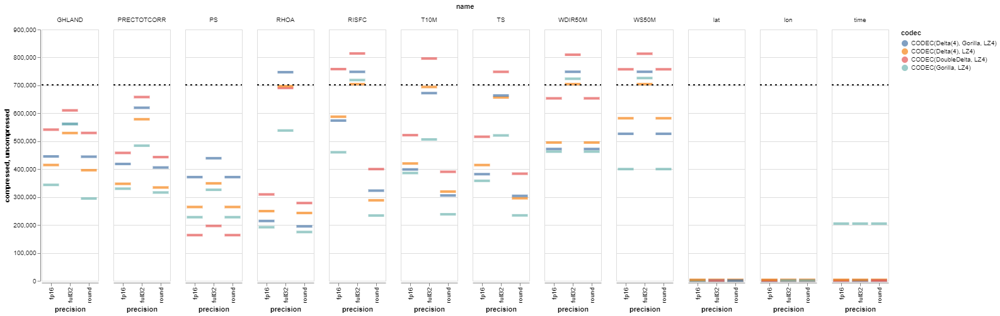

# merra2_subsetter
This repo contains two tangentially related experiments.
1. I needed an excuse to play around with asynchronous programming, so I built a tool to download subsets of MERRA-2 reanalysis data. I added rate and concurrency limiting to avoid hogging server resources.
    * I found httpx to be an easier framework to use than aiohttp. Also, I never got aiohttp to work due to an arcane problem with NASA's OAuth (they use an outdated timestamp format in their session cookie that the built-in urllib CookieJar class no longer supports). But httpx worked right out of the box.

2. I also needed an excuse to try the Clickhouse columnar database, so I used the MERRA-2 data from above to test various data compression schemas in Clickhouse.
   * I found that for floating point data, the most impactful choice was simply how much false precision to keep. Discarding false precision *can* make sense (watch out for derivatives!), but the risks of being wrong or not anticipating a future use case generally outweigh the rewards. Disk space is cheap; re-collecting data may not even be possible.
   * The choice of compression algorithms in Clickhouse only mattered for floats if data was oversampled or if there were unused bits (trailing zeros) that could be removed. In those cases, the Gorilla XOR codec was most effective.
   * A better option for lossy compression of multi-dimensional data would probably be zfp ("jpeg for spatial data").

The dashed line is at the uncompressed size
